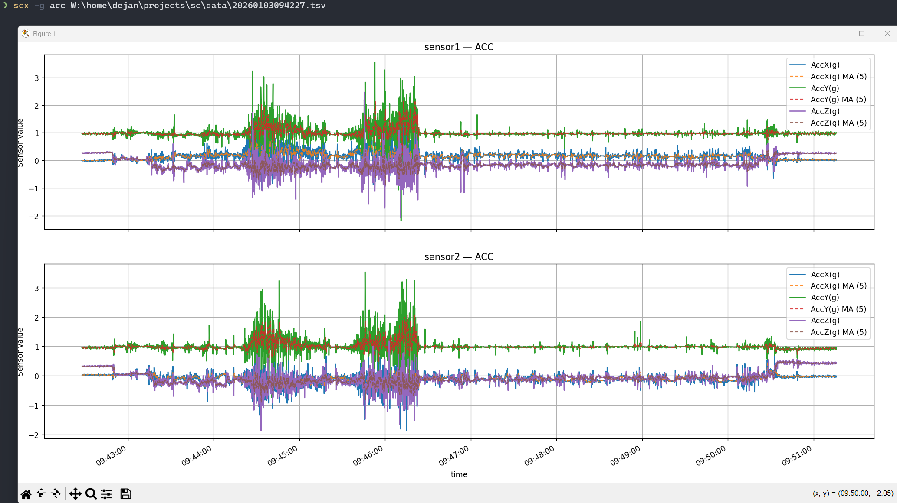

# sc

Simple command-line utility for plotting sensor data from SC export files.

## _**Installation**_

### I recommend [uv](https://docs.astral.sh/uv/):
```bash
$ uv tool install git+https://github.com/dejansa/sc.git

# To upgrade to latest version run:
$ uv tool upgrade sc
# or
$ uv tool upgrade --all
```

### [pipx](https://github.com/pypa/pipx) can also be used:
```bash
$ pipx install git+https://github.com/dejansa/sc.git

# To upgrade to latest version run:
$ pipx upgrade sc

# or

$ pipx upgrade-all
```

## _**Usage**_

```bash
❯ scx --help
usage: scx [-h] [-g GROUP] [-ma MA_WINDOW] [file]

Read CSV data for SC script

positional arguments:
  file                  Path to the CSV file to parse

options:
  -h, --help            show this help message and exit
  -g GROUP, --group GROUP
                        Comma-separated column groups to visualize (valid: acc, as, ang, h; default: acc)
  -ma MA_WINDOW, --ma-window MA_WINDOW
                        Simple moving average window size per signal (default: 5)
```

### **_example_**


